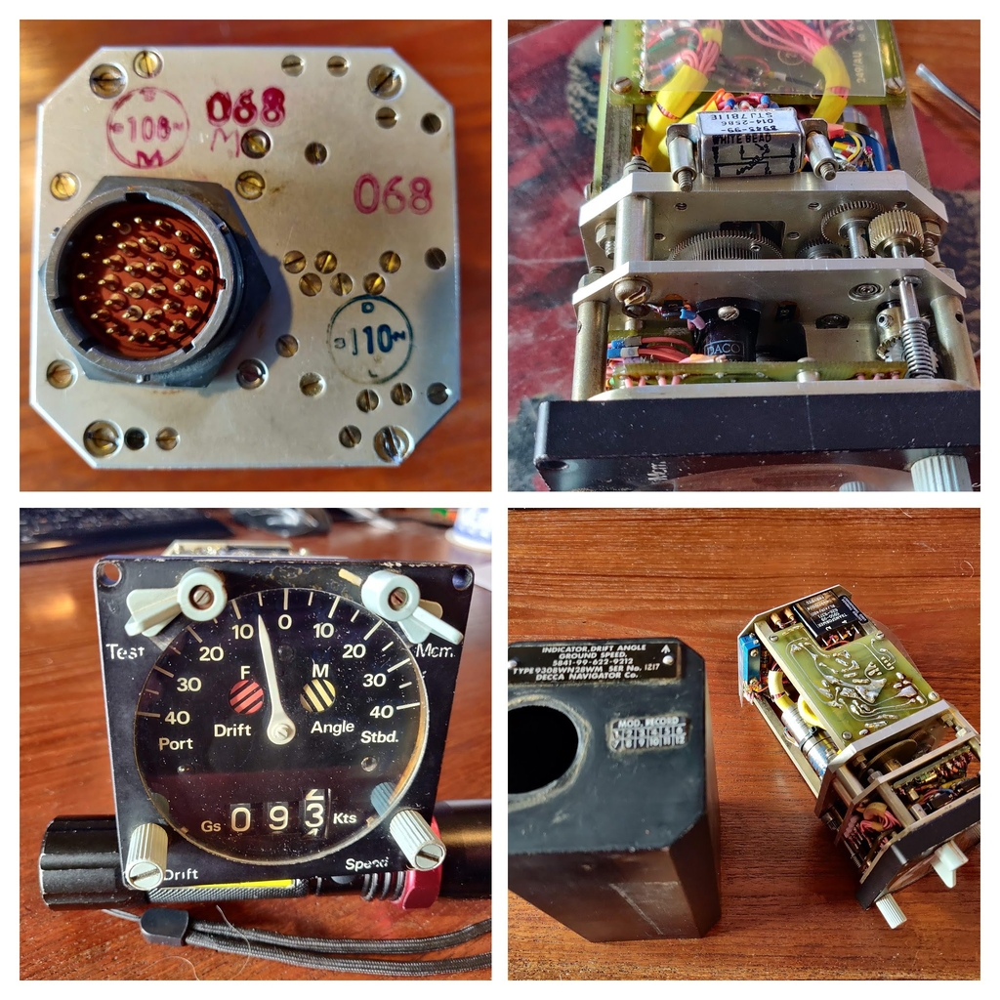
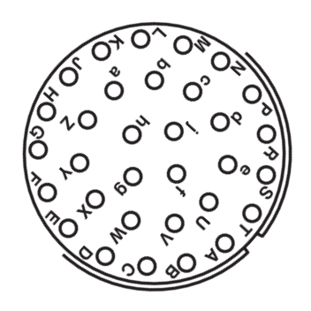
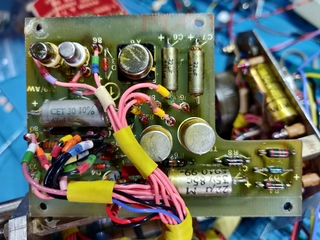
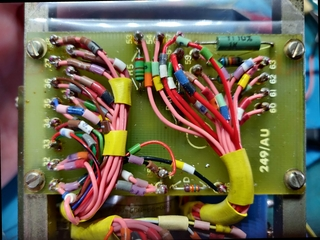
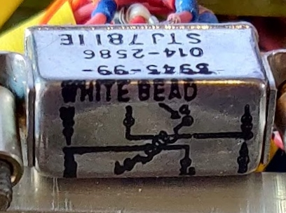
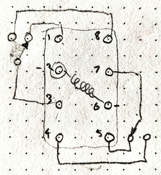

# Drift Angle & Ground Speed Indicator

Decca 5841-99-622-9212 Type 9308WN28WM

Note: none of these details are verified correct, WIP

## Connector

Details as seen from rear when unit level, connector is skewed from standard. 

|Outer row| Wire    | Term      |          |Middle row| Wire   | Term      |
|---------|---------|-----------|--------- |----------|--------|-----------|
|         |         |---------- |----------|          |        |           |
| A       |red-59   |rly2:coil a|          | U        |pink-95 |Pot1       |
| B       |pink-62  |rly7:Com   |          | V        |pink-89 |18 unknown |
| C       |black-96 |tran9:     |          | W        |red-91  |rly6:coil b|
| D       |pink-120 |40-fp112   |          | X        |pink-74 |S-black7   |
| E       | n/c     |           |          | Y        |pink-80 |S-red9     |
| F       |pink-70  |32  unknown|          | Z        |red-90  |rly6:coil b|
| G       |pink-63  |rly5:NC    |          | a        |pink-58 |41 unknown |
| H       |pink-77  |rv1        |          | b        | n/c    |           |
| J       |pink-75  |rv2, C2, C3|          | c        |pink-64 |17 unknown |
| K       |pink-81  |14 unknown |          | d        | n/c    |           |
| L       |pink-73  |32 unknown |          | e        | n/c    |           |
| M       | n/c     |           |          |          |        |           |
| N       | n/c     |           |          |Inner row | Wire   | Term      |
| P       | n/c     |           |          | f        |pink-119|39-fp111   |
| R       | red-60  |DC in red  |          | g        |black-93|chassis    |
| S       | pink-121|113-fp     |          | h        |black-87|78,79,black|
| T       | pink-61 |rly7:Com   |          | j        |pink-122|38-fp114   |

Notes:

 * B&T connected,
 * W&Z connected
 * R main DC +ve feed to amp
 * C, W, g, h, common -ve
 * Front panel bulbs all open circuit!
 * 26 V 400 Hz input pins chassis and B or T
 * Signal input pins ?

 

## Back panel

|      |                      |                      |
|------|----------------------|----------------------|
| 3    |                      |                      |
| 4    |                      |                      |
|      |                      |                      |
| 6 & 7|black-52,C10-?,C11-?  |                      |
| 8    |black-98,black-22,C8-?|                      |
| 9    |pink-21,pink-43,C8    |                      |
| 10   |pink-44,C10           |                      |
| 11   |pink-45,C11           |                      |
| 12   |S-black7,pink-74      |                      |
| 13   |S-red9,pink-80        |                      |
| 14   |pink-91,pink-81       |'K'                   |
| 15   |pink-77,pink-78,C2-?  |'H'                   |
| 16   |pink-76,pink-77,C?    |C2 to 'pink-75, 'J'   |
| 17   |pink-65,pink-64       |'c'                   |
| 18   |pink-97,pink-86       |Resolver-S7,Pot2-wiper|
| ??   |pink-75,S-white3,C2-? |'J'                   |
| 19   |pink-76,C3-?          |C3 to pink-75, 'J'    |
| 20   |pink-75,yellow-7147,C3|'J' 50 ohms to chassis|
| E1   |black-125,black-93    |chassis               |

 

## No.1 PCB

|Term|Wires              |                      |
|----|-------------------|----------------------|
| 71 |red-55,red-88      | DC                   |
| 72 |black-92           |Chassis E2            |
| 73 |pink-57            |TR1 input             |
| 74 |black-91,black-42  |Transformer9          |
| 75 |black-33,black-96  |Pot3                  |
| 76 |pink-54            |R7,C to SL201-2       |
| 77 |pink-31,pink-97    |Resolver-S7,Pot2-wiper|
| 78 |S-blue7167,black-85|?                     |
| 79 |black-52,black-84  |T6&7                  |
| 80 |pink-32,pink-95    |Pot1  'U'             |
| 81 |pink-53            |R5-1k8,C to SL201-3   |
| 82 |pink-41            |TR2-c,Transformer7    |
| 83 |pink-40            |TR3-cTransformer4     |
| 84 |pink-28            |Resolver R2           |
| 85 |pink-27            |Resolver R1           |
| 86 |pink-56            |R10-10k               |

 

## No.2 PCB

|Term |Wires                 |                      |
|-----|----------------------|----------------------|
|  31 |pink-69,pink-70       |                      |
|  32 |pink-72,pink-73       |                      |
|  33 |S-green8,S-red/black9 |                      |
|  34 |S-lime18,S-red/black19|                      |
|  35 |S-blue767,pink-83     |                      |
|  36 |S-brown1,pink-82      |                      |
|  37 |pink-117,pink-121     |                      |
|  38 |pink-118,pink-123     |                      |
|  39 |pink-115,pink-119     |                      |
|  40 |pink-116,pink-120     |                      |
|  41 |pink-58,pink-124      |                      |
|     |                      |                      |
| 53  |pink-53, R5-1k8       |                      |
| 54  |pink-54, R7-1k8       |                      |
| 55 -|pink-39,pink-123      |link DC               |
| 56 -|red-59,red-60         |link DC  'A'          |
| 57 -|red-89,red-55         |link DC               |
| 58  |pink-56,R10-10k       |                      |
| 59  |pink-57,R21-1K        |to Cx - TR1           |
| 60  |pink-25,R21           |                      |
| 61  |pink-29,R12-2k2       |                      |
| 62  |pink-50,R12           |                      |
| 63  |pink-24,pink-97       |Resolver-S7,pot2-wiper|
| 64 -|pink-78,pink-79       |link                  |
| 65 -|S-black17,S-red5      |link                  |
| 66  |black-94              |chassis               |

 

## No.2 PCB

|Term |Wires                 |                      |
|-----|----------------------|----------------------|
|  31 |pink-69,pink-70       |                      |
|  32 |pink-72,pink-73       |                      |
|  33 |S-green8,S-red/black9 |                      |
|  34 |S-lime18,S-red/black19|                      |
|  35 |S-blue767,pink-83     |                      |
|  36 |S-brown1,pink-82      |                      |
|  37 |pink-117,pink-121     |                      |
|  38 |pink-118,pink-123     |                      |
|  39 |pink-115,pink-119     |                      |
|  40 |pink-116,pink-120     |                      |
|  41 |pink-58,pink-124      |                      |
|     |                      |                      |
| 53  |pink-53, R5-1k8       |                      |
| 54  |pink-54, R7-1k8       |                      |
| 55 -|pink-39,pink-123      |link                  |
| 56 -|red-59,red-60         |A link                |
| 57 -|red-89,red-55         |link                  |
| 58  |pink-56,R10-10k       |                      |
| 59  |pink-57,R21-1K        |                      |
| 60  |pink-25,R21           |                      |
| 61  |pink-29,R12-2k2       |                      |
| 62  |pink-50,R12           |                      |
| 63  |pink-24,pink-97       |Pot2-wiper,Resolver-S7|
| 64 -|pink-78,pink-79       |link                  |
| 65 -|S-black17,S-red5      |link                  |
| 66  |black-94              |chassis               |

 

## RLA Relay
  

24 Volt,  830 Ohm

|Pin  |Wire   |     |
|-----|-------|-----|
| 1 |n/c      |NC-8           |
| 2 |red-89   |coil-a         |
| 3 |pink-103 |Com-1&8        |
| 4 |         |NO-7           |
| ''|orange-11|synchro GEN 26V|
| ''|orange-1 |synchro GEN 26V|
| ''|pink-11  |               |
| 5 |pink-63  |NC-7           |
| 6 |red-90   |coil-b         |
| ''|red-91   |               |
| 7 |pink-61  |Com-4&5        |
| ''|pink-62  |               |
| 8 |pink-79  |NO-8           |

 

## Misc Bindings

| Terminal    | Wire                                   | Function           |
|-------------|----------------------------------------|--------------------|
|  t113     |pink-121                                | fp                 |
|  t39,t111 |pink-119                                | fp                 |
|  t38,t114 |pink-122                                | fp                 |
|           |                                        |                    |
| chassis E1|black-125, black-93                     |                    |
| chassis E2|S-grey12, S-white13, S-grey2, S-white747|                    |
| chassis E2|black-92, black-94, black-125           |                    |
| chassis E3|S-black-67, S-black-37                  |Flag motor?         |
|           |                                        |                    |
| RV1-1     |pink-46                                 |                    |
| RV1-2     |pink-30                                 |                    |
| RV2-1     |pink-47                                 |                    |
| RV2-1     |pin-50                                  |                    |
|           |                                        |                    |
|TestSw1    |pink-71                                 |                    |
|TestSw2    |pink-68                                 |                    |
|MomSw1     |pink-66                                 |                    |
|MomSw2     |black-68                                |                    |
|           |                                        |                    |

 

## Transformer

|Pin#|Wire     |               |
|----|---------|---------------|
|1   |n/c      |               |
|2   |link to 8|               |
|3   |n/c      |               |
|4   |pink-40  |TR2-c          |
|5   |n/c      |               |
|6   |n/c      |               |
|7   |pink-41  |TR3-c          |
|8   |pink-39  |71,red (DC+ve) |
|9   |black-42 |to resolver 26v|
|10  |black-43 |to resolver 26v|

 

## X4 Drift Resolver Compensating 

|Name|Wire    |                      |
|----|--------|----------------------|
|S1  |pink-21 |transformer #10       |
|S3  |black-22|transformer # 9       |
|S2  |link to |S2-S4 linked          |
|S4  |pink-26 |S2-S4 linked          |
|S5  |pink-25 |R21                   |
|S7  |pink-24 |Resolver-S7,Pot2-wiper|
|S6  |link to |S6-S8 linked          |
|S8  |pink-30 |S6-S8 linked          |
|R1  |pink-27 |to Cx - TR2           |
|R3  |pink-29 |R12                   |
|R2  |pink-28 |to Cy - TR3           |
|R4  |pink-30 |RV1-2                 |

 

## X5 Speed Potentiometer

2k ohms 5%

|pin|wire    |
|-|----------|
| 1 |pink-32 |80|
| 2 |pink-31 |wiper 77|
| 3 |black-33|75|

 

## X1 Speed Servo Tachometer
200:1 gearbox

|Colour   |Terminal|Wire|
|---------|--------|----|
|black    |        |
|brown    |        |
|red      |        |
|red/black|        |
|yellow   |        |
|orange   |        |
|green    |        |
|blue     |        |
|grey     |        |
|white    |        |

 

## X2 Drift Servo Motor Tachogenerator (blue)

 * SM | Y-W 26V| R-R/BK 13V | G-BK 13V  
 * GEN | O-GY 26V | B-BN 0.285V/1000 RMM

| code | colour    | terminal||
|------|-----------|---------|-|
|  Y   | yellow    | SM 26V  |yelow7147|
|  W   | white     | SM 26V  |chassis|
|  R   | red       | SM 13Va |
|  R/BK| red/black | SM 13Va |
|  G   | lime-green| SM 13Vb |
|  BK  | black     | SM 13Vb |
|  O   | orange    | GEN 26V |to relay4
|  GY  | grey      | GEN 26V |chassis|
|  B   | blue      | GEN RPM |
|  BN  | brown     | GEN RPM |

